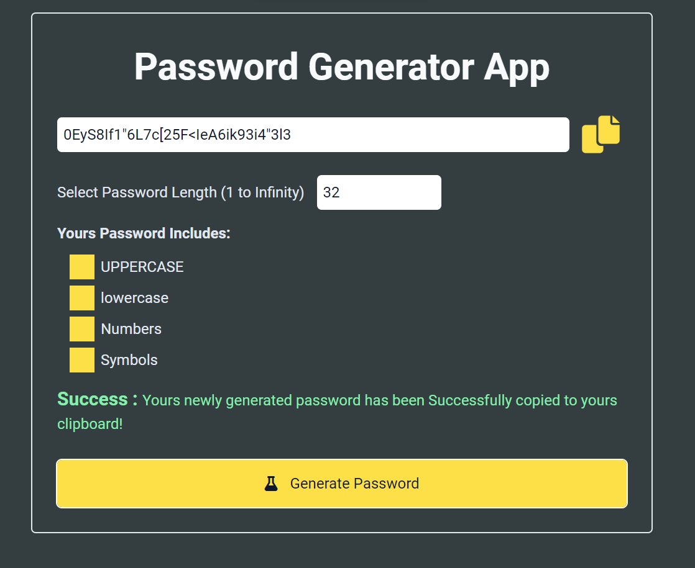

# M5React Weekly Test 1 Project Password generator tool


## Hosted Version of the Project:
[m5react-weekly-test-1-project-password-generator-tool](https://m5react-weekly-test-1-project-password-generator-tool.vercel.app/)

## Objective
Develop a react application for the password generator generator tool with Check boxes for customizing password criteria, Options for selecting password length, Generates random passwords based on selected criteria, and implement Copy functionality for easy usage and provide User-friendly interface.


## How to install and run in yours local machine
```bash
npm install
npm run start
```

## Tech. Stack Used:
+ [React](https://react.dev/)
+ [Google Fonts](https://fonts.google.com/)
+ [Font Awesome](https://fontawesome.com/icons/)

## Author
[Abhishek kumar](https://www.linkedin.com/in/alex21c/), ([Geekster](https://geekster.in/) MERN Stack FS-14 Batch)


